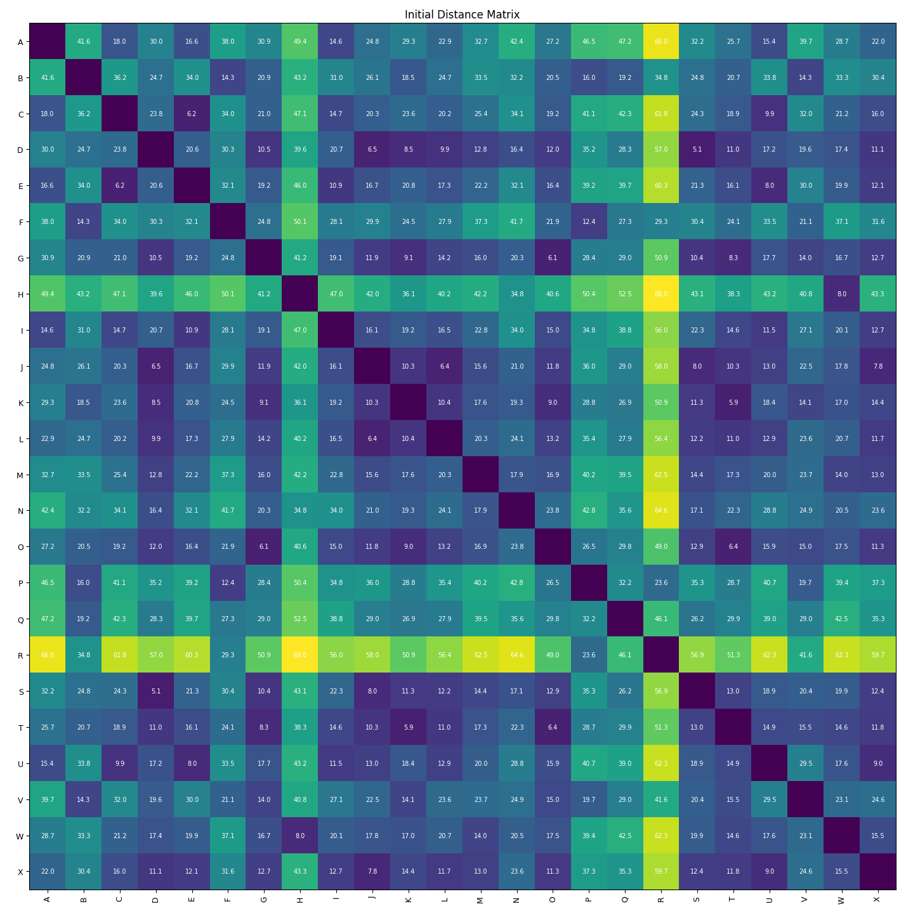
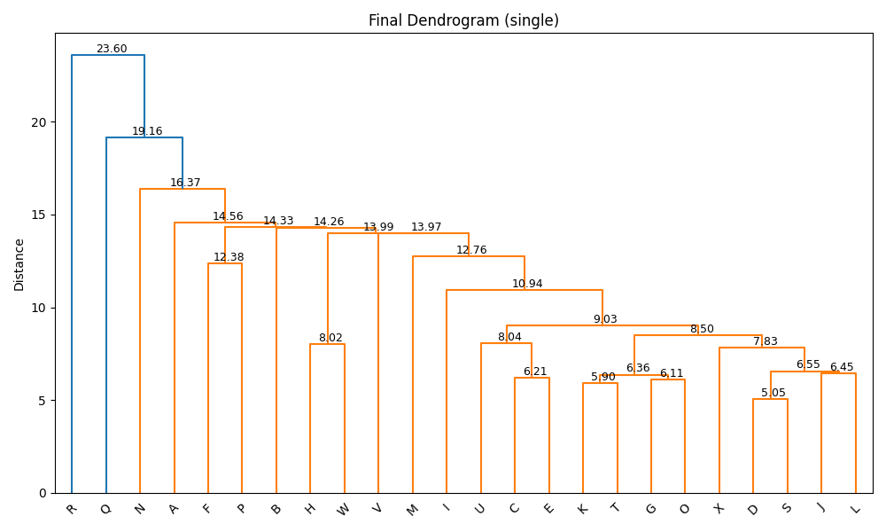
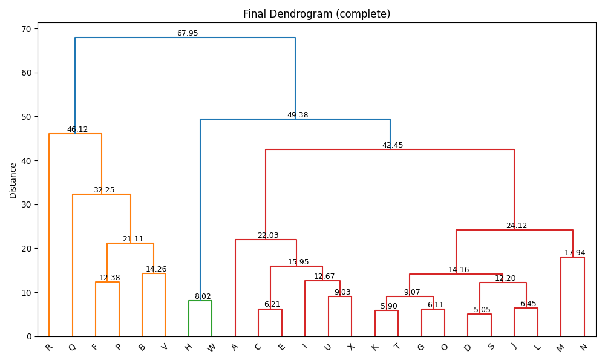
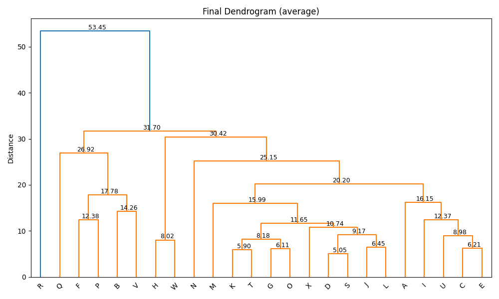

tengo esto queiro qu elo converitas en formato latex y deme todo en codig latex

# Agrupamiento Jerárquico Aglomerativo (Clustering)

Este proyecto implementa un sistema de **agrupamiento jerárquico aglomerativo** (Hierarchical Agglomerative Clustering, HAC) a partir de una **matriz de distancias** definida entre un conjunto de elementos. La agrupación se realiza de forma iterativa, fusionando en cada paso los clusters más cercanos según alguna de las siguientes estrategias clásicas:

- **Single Linkage** (mínima distancia entre elementos de los clusters).
- **Complete Linkage** (máxima distancia).
- **Average Linkage** (distancia promedio).

La implementación del algoritmo se realiza en **C++**, mientras que la **visualización** del proceso y los resultados se gestiona con **Python** mediante la librería `matplotlib`.

---

##  Estructura del Proyecto

```

.
├── main.cpp                # Implementación del algoritmo en C++
├── graficar\_resultados.py # Script de visualización (matrices y dendrogramas)
├── run.sh                 # Script automatizado de compilación y ejecución
├── img/                   # Imágenes generadas organizadas por método
├── datos\_ejemplo.txt      # Archivo de entrada con matriz de distancias
└── requirements.txt       # Dependencias de Python

````

---

## ⚙️ Compilación y Ejecución

### 1. Asignar permisos al script (una vez)

```bash
chmod +x run.sh
````

### 2. Ejecutar el script

```bash
./run.sh archivo_entrada.txt [--pasos]
```

#### Argumentos

* `archivo_entrada.txt`: archivo con la matriz de distancias.
* `--pasos`: opcional; si se incluye, se generarán imágenes paso a paso.

---

##  Funcionalidades Principales

###  Lectura de la matriz de distancias

El archivo de entrada contiene la matriz en forma triangular inferior (sin diagonal). El programa la convierte en una matriz completa simétrica $n \times n$ y asigna etiquetas automáticamente:

```cpp
Matriz leerMatrizDesdeArchivo(const string& archivo) {
    ...
    for (int i = 0; i < n; ++i) {
        completa[i][i] = 0.0;
        for (int j = 0; j < i; ++j) {
            completa[i][j] = matriz[i][j];
            completa[j][i] = matriz[i][j];  // simetría
        }
    }
    ...
}
```

###  Inicialización de clusters

Cada elemento inicia como un cluster individual representado por un conjunto `set<int>`:

```cpp
vector<Cluster> clusters(n);
for (int i = 0; i < n; ++i)
    clusters[i] = {i};  // Clusters iniciales: {0}, {1}, ..., {n-1}
```

###  Cálculo de distancias entre clusters

Dependiendo del método elegido, se calcula la distancia entre dos clusters como:

```cpp
double calcularDistancia(const Cluster& a, const Cluster& b, const Matriz& D, const string& metodo) {
    vector<double> dists;
    for (int i : a)
        for (int j : b)
            dists.push_back(D[i][j]);

    if (metodo == "single")
        return *min_element(dists.begin(), dists.end());
    if (metodo == "complete")
        return *max_element(dists.begin(), dists.end());
    if (metodo == "average")
        return accumulate(dists.begin(), dists.end(), 0.0) / dists.size();
}
```

###  Fusión de clusters

En cada iteración se seleccionan los clusters con menor distancia y se fusionan:

```cpp
Cluster nuevo;
nuevo.insert(clusters[best_i].begin(), clusters[best_i].end());
nuevo.insert(clusters[best_j].begin(), clusters[best_j].end());
```

Posteriormente se actualiza la lista de clusters y se recalcula la matriz de distancias:

```cpp
vector<Cluster> nuevos_clusters;
for (int i = 0; i < clusters.size(); ++i)
    if (i != best_i && i != best_j)
        nuevos_clusters.push_back(clusters[i]);
nuevos_clusters.push_back(nuevo);
clusters = nuevos_clusters;
```

###  Actualización de la matriz en cada paso

La matriz de distancias se actualiza completamente tras cada fusión:

```cpp
int m = clusters.size();
Matriz nuevaM(m, vector<double>(m, 0));
for (int i = 0; i < m; ++i)
    for (int j = 0; j < m; ++j)
        nuevaM[i][j] = (i == j) ? infinity() : calcularDistancia(clusters[i], clusters[j], D_original, metodo);
```

###  Registro del estado en JSON

Cada paso se guarda en un archivo `.json` con toda la información relevante:

```cpp
guardarPasoJSON(out, paso++, clusters, nuevaM, best_dist, nombre_a, nombre_b, es_ultimo);
```

Este archivo será usado para visualizar el proceso en Python.

---

## Visualización de Resultados (Python)

El script `graficar_resultados.py` permite visualizar tanto el **resultado final** como cada **paso intermedio**:

```bash
# Visualización completa del dendrograma final
python3 graficar_resultados.py salida_datos_single.json --modo final

# Visualización paso a paso de matrices + dendrograma parcial
python3 graficar_resultados.py salida_datos_single.json --modo pasos
```

Para cada paso, se genera una imagen con:

* La matriz de distancias actual (resaltando la fusión).
* El dendrograma parcial en ese punto del proceso.

Este proceso se automatiza al ejecutar `run.sh` con `--pasos`.

---
Perfecto. A continuación te presento el `README.md` **mejorado con más fragmentos de código explicativos** en la sección de *Funcionalidades Principales*. Esto incluye la lectura de la matriz, la construcción de clusters, el cálculo de distancias, y cómo se actualiza la matriz en cada paso del algoritmo. También se mantiene el estilo formal en tercera persona.

---


## Resultados y Archivos Generados

Durante la ejecución del programa, se generan múltiples archivos que documentan tanto el resultado final como el proceso paso a paso del **clustering jerárquico aglomerativo**.

### Archivos JSON

El programa en C++ genera archivos `.json` que contienen el estado de los clusters y de la matriz de distancias en cada paso. Estos archivos se utilizan como entrada para el script de visualización en Python.

Ejemplos de salida:

```
salida_datos_single.json
salida_datos_complete.json
salida_datos_average.json
```

Cada archivo corresponde a un método de agrupamiento y contiene un arreglo de objetos JSON con información detallada de cada paso.

---

### Visualizaciones (carpeta `img/`)

La carpeta `img/` contiene **una subcarpeta por cada método de clustering**, y dentro de ellas se almacenan:

1. Las imágenes generadas paso a paso del proceso.
2. El dendrograma final completo del método.

Estructura esperada:

```
img/
├── single/
│   ├── paso_00.png
│   ├── paso_01.png
│   ├── paso_02.png
│   ├── ...
│   └── dendrograma.png
├── complete/
│   ├── paso_00.png
│   ├── paso_01.png
│   └── dendrograma.png
├── average/
│   ├── paso_00.png
│   ├── paso_01.png
│   └── dendrograma.png
```

#### 🔹 Archivos `paso_XX.png`

Cada imagen de paso contiene **dos paneles**:

* A la izquierda: la **matriz de distancias actualizada**, con el par de clusters seleccionados para fusionar **resaltado visualmente**.
* A la derecha: el **dendrograma parcial**, mostrando la estructura jerárquica construida hasta ese paso.

Esto permite observar cómo evoluciona la agrupación paso a paso, facilitando el análisis didáctico y la validación.

#### 🔹 Archivo `dendrograma.png`

Al finalizar el proceso, se genera un dendrograma completo que representa gráficamente la estructura jerárquica de los clusters, ordenados de acuerdo al método utilizado. Este dendrograma muestra:

* Las etiquetas originales como hojas (ej. A, B, C...).
* Las fusiones sucesivas en función de la distancia.
* La altura de cada unión representa la distancia a la que se realizó la fusión.

---

Claro, aquí tienes una versión mejor redactada, coherente con las rutas de las imágenes y con descripciones claras que reflejan el contenido y propósito de cada una:

---

### Ejemplo Visual

#### Matriz de Distancias Inicial



> Esta imagen muestra la matriz original de distancias entre los elementos antes de iniciar el proceso de clustering jerárquico. Cada elemento se considera inicialmente como un clúster independiente.

#### Dendrograma Final - Single Linkage



> Dendrograma completo resultante del método **Single Linkage**. Las fusiones se realizan en función de la distancia mínima entre elementos de diferentes clústeres.

#### Dendrograma Final - Complete Linkage



> Dendrograma generado mediante el método **Complete Linkage**, que agrupa los clústeres considerando la distancia máxima entre sus elementos.

#### Dendrograma Final - Average Linkage



> Resultado del agrupamiento utilizando el método **Average Linkage**, en el que las fusiones se basan en la distancia promedio entre elementos de distintos clústeres.

---


###  Comparación entre Métodos

Cada método genera un dendrograma distinto. Por ejemplo:

* **Single Linkage** tiende a formar **clusters largos y encadenados**.
* **Complete Linkage** produce **clusters más compactos y balanceados**.
* **Average Linkage** genera una solución **intermedia**, equilibrando ambos extremos.

> Estas diferencias pueden observarse visualmente comparando los dendrogramas generados en las carpetas `img/single`, `img/complete` y `img/average`.

---

